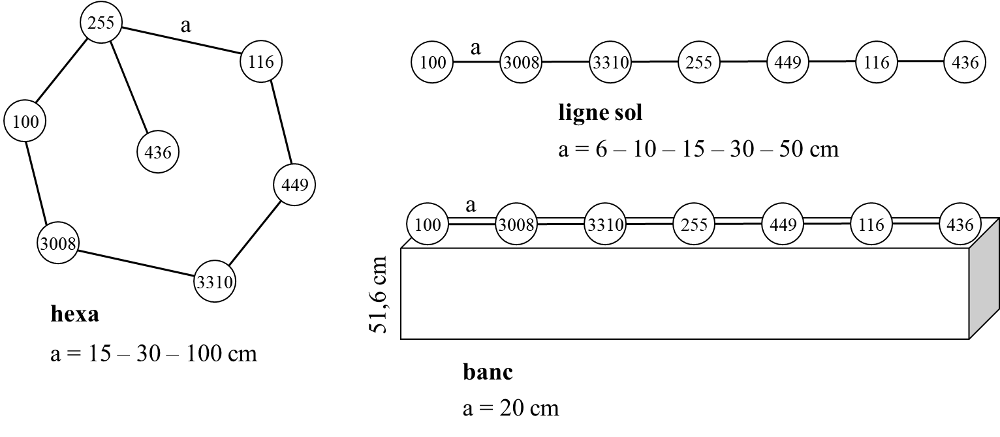

```{r setup, include=FALSE}
knitr::opts_chunk$set(warning = FALSE, message = FALSE)
```

```{r packages, echo=FALSE}
library(dplyr)
library(ggplot2)
library(tidyr)
library(geosphere)
library(plotly)
library(knitr)
library(kableExtra)
library(webshot2)
library(webshot)

#setwd("C:/Users/menassol/Documents/_RECHERCHE/2. SOCIAL NETWORKS OVINS/5. RESEAUX SYNAPSE & EPIDEMIOLOGIE/PROJET PPR ADAMA DIALLO/ANALYSES/PRECISION TESTS/")

setwd("D:/ToOrganize/Raw_data/PPR_Senegal/JBM/ANALYSES/PRECISION TESTS/")
```

### Sensors positions

There were 9 different experiment corresponding to different geometrical structure of exchanges between sensors. These experiments are represented in the following figure (Figure 1) :

{width="70%"}

### Analysis of data

```{r list of positions, echo=FALSE}
path <- "D:/ToOrganize/Raw_data/PPR_Senegal/JBM/ANALYSES/PRECISION TESTS/"

# Get a list of file names in the directory that match the pattern "position3d.csv"
files <- list.files(path = path, pattern = "position3d.csv")

# Initialize a list to store the summary data frames for each file
df_summary <- list()

# Use a for loop to iterate over the list of file names
for(i in 1:length(files)) {
  # Read the CSV file
  data <- read.csv(file = paste0(path, files[i]), stringsAsFactors = FALSE)
  
  # Calculate the summary statistics for each sensor
  df_summary[[i]] <- data %>%
    group_by(sensor) %>%
    summarize(mean_x = mean(X, na.rm=TRUE), sd_x = sd(X, na.rm=TRUE),
              mean_y = mean(Y, na.rm=TRUE), sd_y = sd(Y, na.rm=TRUE),
              mean_z = mean(Z, na.rm=TRUE), sd_z = sd(Z, na.rm=TRUE))
  
  names(df_summary)[i] <- files[i]
  }

list_plots  <-
  lapply(1:length(df_summary),function(i) {
    plot_ly(df_summary[[i]], x = ~mean_x, y = ~mean_y, z = ~mean_z,
            type = "scatter3d", mode = "markers",
            marker = list(size = 10),
            error_x = list(array = ~sd_x),
            error_y = list(array = ~sd_y),
            error_z = list(array = ~sd_z),
            text = ~sensor,
            legendgroup = ~sensor) %>%
      
      layout(title=paste0(files[i]))
  })

```

For each experiment, the position of each sensor is described as the mean +/- sd of their x, y and z values.
These mean positions are stored in a list for each experiment and used to construct 3D plots of each sensor position.

### Results

Tables of means +/- sd x, y, z positions for each sensor at each experiment

```{r tables, results = "asis", echo = FALSE}

for(i in seq_along(df_summary)) {
  print(
    kable(df_summary[[i]], caption = names(df_summary)[i], longtable = FALSE) %>%
      kable_styling(font_size = 12, latex_options = "repeat_header", full_width = TRUE)
  )
}

```

#### 3D graphs

As we can see on these graphs, sensor 3310 tends to be misplaced especially on the z-axis
Further data exploration should be undertaken for example to exclude data situated at the beginning and end of recording sessions or verify how sensor 3310 behave during further experimental procedures.

```{r}
library(plotly)

dir.create("figures", showWarnings = FALSE)

for (i in seq_along(df_summary)) {
  p <- plot_ly(df_summary[[i]], x = ~mean_x, y = ~mean_y, z = ~mean_z,
               type = "scatter3d", mode = "markers",
               marker = list(size = 5),
               error_x = list(array = ~sd_x),
               error_y = list(array = ~sd_y),
               error_z = list(array = ~sd_z),
               text = ~sensor)

  png_file <- paste0("figures/plotly_static_", i, ".png")

  # Use orca to export the plot as PNG
  plotly::export(p, file = png_file)

  cat(paste0("#### ", names(df_summary)[i], "\n\n"))
  print(knitr::include_graphics(png_file))
}


```


```{r 3Dgraphs, results = "asis", echo = FALSE, eval=FALSE}

#htmltools::tagList(lapply(1:length(list_plots),function(i) {list_plots[i]}))

```